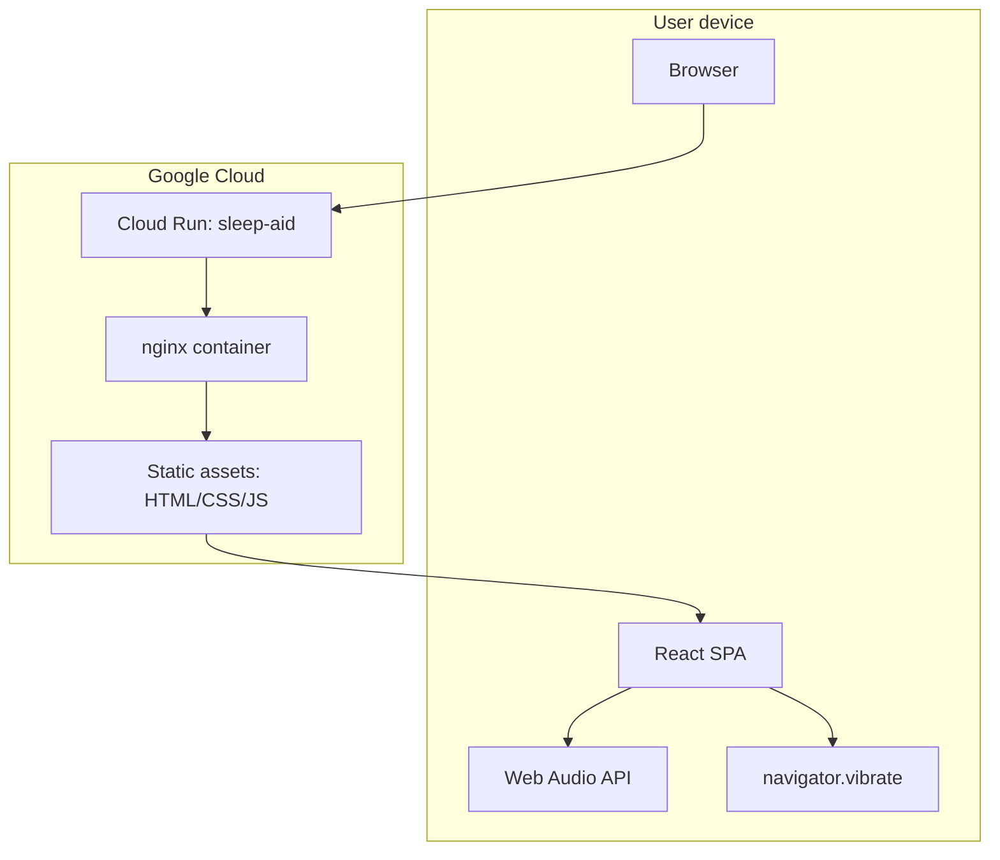
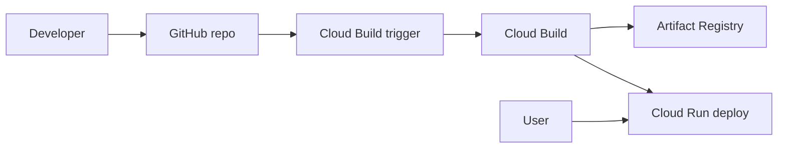
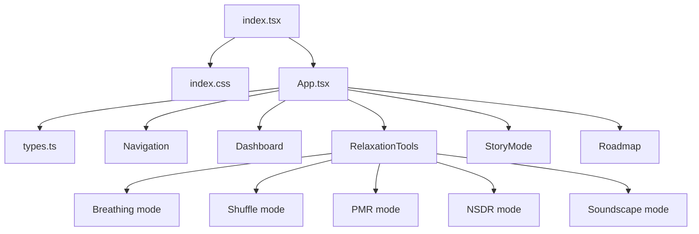
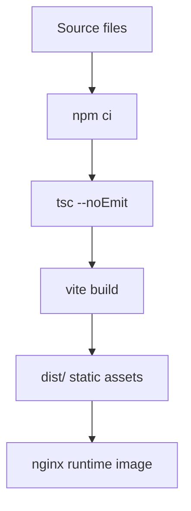
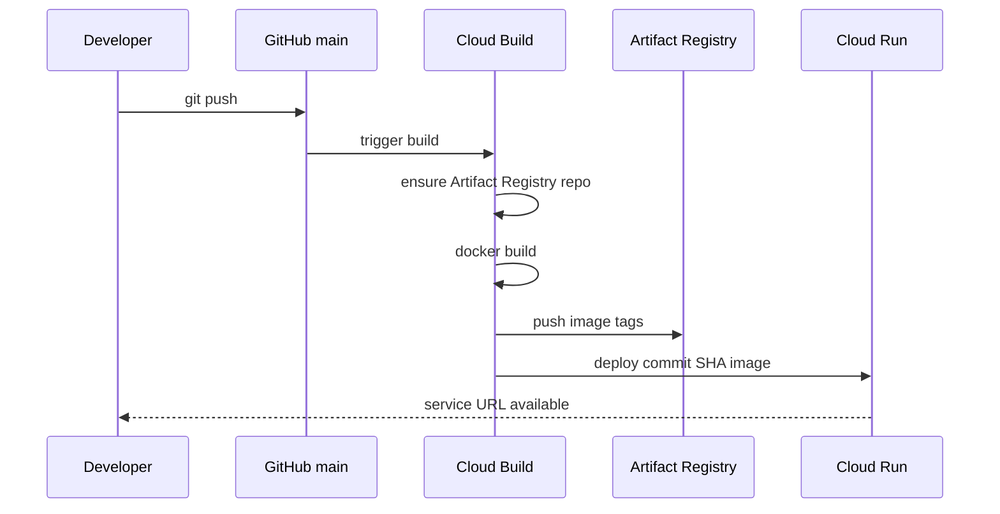

# Sleep Aid Architecture

Last updated: 2026-04-22

## Purpose

This document describes the architecture of Sleep Aid across three layers:

1. Product runtime architecture: what runs in the browser.
2. Build and deployment architecture: how code becomes a Cloud Run service.
3. Evolution architecture: how the app should grow without losing its low-friction, offline-first design.

The companion documents are:

- `docs/PRODUCT_DESIGN.md` for product intent, users, workflows, and roadmap.
- `docs/TECHNICAL_DESIGN.md` for implementation details, testing, deployment mechanics, and technical risks.

## Architecture Summary

Sleep Aid is a static React SPA served by nginx in a Cloud Run container. The browser owns all current application behavior. There is no backend, database, authentication service, analytics collector, or private API dependency.



## Architectural Principles

| Principle | Architectural implication |
| --- | --- |
| Offline-first core behavior | Keep current features static and client-side unless a feature truly needs backend state |
| Low operational surface | Prefer static assets, nginx, Cloud Run, and no runtime secrets |
| Fast first interaction | Lazy-load feature views and avoid blocking app shell render |
| Privacy by default | Do not collect user data without a deliberate privacy design |
| Deterministic deploys | Use `npm ci`, `package-lock.json`, Docker build checks, and immutable image tags |
| Feature isolation | Keep major intervention modes modular enough to evolve independently |
| Night-safe UX | Avoid architecture choices that require disruptive auth, modals, bright consent flows, or complex setup before use |

## System Context



External systems:

| System | Role |
| --- | --- |
| GitHub | Source repository and trigger source |
| Cloud Build | CI/CD pipeline |
| Artifact Registry | Container image storage |
| Cloud Run | Managed container runtime |
| Browser Web Audio API | Generates local soundscapes |
| Browser Vibration API | Optional haptic cues on supported devices |
| Google Fonts | Current font source via CSS import |

## Runtime Architecture

### Browser Runtime

The browser downloads static assets from Cloud Run and executes the React SPA.

Runtime responsibilities:

- Render the app shell.
- Manage the active view.
- Run local timers for breathing, shuffle, PMR, and dashboard updates.
- Generate audio locally through Web Audio.
- Trigger optional haptics where supported.
- Render static sleep stories, scripts, facts, and roadmap entries.

Runtime non-responsibilities:

- User authentication.
- User profile persistence.
- Server-side rendering.
- API orchestration.
- Analytics/event upload.
- Medical inference.

### Cloud Run Runtime

Cloud Run runs a single nginx container.

Container responsibilities:

- Listen on port `8080`.
- Serve `index.html`.
- Serve Vite-generated assets from `/assets/`.
- Return `/index.html` for SPA fallback.
- Set simple cache headers.

Container non-responsibilities:

- Running Node.js in production.
- Running Vite preview in production.
- Calling APIs.
- Managing user sessions.

## Application Module Architecture

Current source topology:



### App Shell

`App.tsx` is the composition root.

Responsibilities:

- Own active `AppView`.
- Lazy-load feature views.
- Render page transition wrapper.
- Render bottom navigation.
- Provide loading fallback.

Dependency rule:

- `App.tsx` may import feature view entry components.
- Feature components should not import `App.tsx`.
- Feature components should avoid cross-importing each other.

### Navigation

`components/Navigation.tsx` maps app views to bottom navigation controls.

Responsibilities:

- Display tab icons and labels.
- Show active state.
- Call `onNavigate(AppView)`.

Dependency rule:

- Navigation depends on `types.ts`, not feature implementations.

### Home Dashboard

`components/Dashboard.tsx` is a local-time guidance module.

Responsibilities:

- Calculate current local time.
- Derive sleep pressure from fixed wake-time assumption.
- Derive circadian phase bucket.
- Flag caffeine risk.
- Generate sleep-cycle wake time suggestions.
- Render sleep hygiene guidance cards.

Architecture constraint:

- Keep calculations deterministic and local until preferences or real sleep data exist.

### Relaxation Tools

`components/BreathingExercise.tsx` is currently a multi-mode feature hub.

Responsibilities:

- Mode switching.
- Active/inactive state.
- Breathing phase timer.
- Shuffle word timer.
- PMR step timer.
- NSDR script selection.
- Soundscape audio graph creation and cleanup.
- Optional haptics.

Architecture constraint:

- This is the highest-complexity component. If more modes are added, split each mode into a child component and move shared data into `data/` modules.

Recommended future boundary:

```text
components/relaxation/
  RelaxationTools.tsx
  BreathMode.tsx
  ShuffleMode.tsx
  PmrMode.tsx
  NsdrMode.tsx
  SoundscapeMode.tsx
  relaxationData.ts
```

### Story Mode

`components/StoryMode.tsx` owns the static story library and reader.

Responsibilities:

- Render story list.
- Track selected story.
- Render reader mode.
- Return to library.

Architecture constraint:

- Story content should move out of component code if the library grows.

### Roadmap

`components/Roadmap.tsx` displays a static in-app roadmap.

Responsibilities:

- Show released/planned/concept items.
- Communicate product direction.

Architecture question:

- Keep roadmap in-app during early iteration; consider moving to docs before a public release if it distracts from bedtime workflows.

## State Architecture

Current state is local React component state only.

| State | Owner | Scope |
| --- | --- | --- |
| Active app view | `App.tsx` | Whole app |
| Current time | `Dashboard.tsx` | Dashboard |
| Random sleep fact | `Dashboard.tsx` | Dashboard |
| Relax mode | `BreathingExercise.tsx` | Relax tab |
| Active timer state | `BreathingExercise.tsx` | Relax tab |
| Haptics enabled | `BreathingExercise.tsx` | Breath mode |
| Active NSDR script | `BreathingExercise.tsx` | NSDR mode |
| PMR step index | `BreathingExercise.tsx` | PMR mode |
| Soundscape active preset | `BreathingExercise.tsx` | Sound mode |
| Selected story | `StoryMode.tsx` | Stories tab |

There is no global state library. This is appropriate for the current app size.

When to add a state abstraction:

- User preferences are shared by multiple views.
- URL routing/deep linking is added.
- Persistent local settings require migration/default handling.
- Multiple features need coordinated session state.

## Data Architecture

Current data categories:

| Category | Storage | Mutability |
| --- | --- | --- |
| Sleep facts | Static array in component | Build-time only |
| Story content | Static array in component | Build-time only |
| NSDR scripts | Static array in component | Build-time only |
| PMR steps | Static array in component | Build-time only |
| Sound presets | Static array in component | Build-time only |
| Roadmap entries | Static array in component | Build-time only |
| User data | None | Not stored |

Recommended future data layout:

```text
data/
  dashboardContent.ts
  relaxationContent.ts
  stories.ts
  roadmap.ts
```

This keeps components focused on interaction and rendering.

## Build Architecture



Build invariants:

- `package-lock.json` must match `package.json`.
- `npm run check` must pass.
- `index.tsx` must import `index.css`.
- `vite.config.ts` must include React and Tailwind plugins.
- `dist/` is generated and not committed.

## Deployment Architecture



Deployment invariants:

- Cloud Build config path is `cloudbuild.yaml`.
- Cloud Run service name defaults to `sleep-aid`.
- Artifact Registry repo defaults to `sleep-aid`.
- Region defaults to `us-central1`.
- Runtime listens on `8080`.
- Cloud Run deploy uses `--port=8080`.

## Artifact Architecture

| Artifact | Producer | Consumer |
| --- | --- | --- |
| `dist/` | Vite build | Docker build stage |
| Docker image `$COMMIT_SHA` | Cloud Build | Cloud Run deploy |
| Docker image `latest` | Cloud Build | Manual rollback/testing reference |
| Cloud Run revision | `gcloud run deploy` | User traffic |
| `.code-review-graph/graph.db` | code-review-graph | Local coding agents |

Git policy:

- Commit source, config, docs, and lockfile.
- Do not commit `dist/`, `node_modules/`, local graph DB, local agent state, or environment files.

## Dependency Architecture

Runtime dependencies:

| Dependency | Purpose |
| --- | --- |
| `react` | UI rendering |
| `react-dom` | DOM root |
| `framer-motion` | View and component animation |
| `lucide-react` | Icons |

Development/build dependencies:

| Dependency | Purpose |
| --- | --- |
| `vite` | Dev server and production bundler |
| `typescript` | Type checking |
| `@vitejs/plugin-react` | React support in Vite |
| `tailwindcss` | Utility CSS engine |
| `@tailwindcss/vite` | Tailwind Vite integration |
| `@types/node` | Node type support for config files |

Dependency rules:

- Do not add libraries for simple local state.
- Use browser APIs for audio/haptics where practical.
- Add a library only when it reduces complexity or provides proven domain behavior.
- Avoid dependencies that require runtime secrets in the browser.

## Browser API Architecture

### Web Audio

Soundscape mode creates:

- Noise buffer source.
- Stereo panner for noise.
- Low-frequency oscillator for panning movement.
- Binaural sine oscillators.
- Gain nodes.

Lifecycle rule:

- Audio context must be closed when stopping audio, switching away from sound mode, or unmounting.

### Haptics

Breathing mode optionally calls `navigator.vibrate`.

Lifecycle rule:

- Haptics are off by default.
- Calls are feature-detected.
- Unsupported devices should silently no-op.

## Security Architecture

Current security boundary:

```text
Browser <-> Cloud Run static asset server
```

No privileged data crosses the boundary because the app does not collect user data or call private APIs.

Security invariants:

- No private API keys in source.
- No secrets in `.env` committed to git.
- No server-side user state.
- No client-side tracking added without a privacy design.

Future hardening:

- Add security headers in `nginx.conf`.
- Add Content Security Policy after deciding the font strategy.
- Add dependency audit in CI.
- Add release checklist for privacy-impacting changes.

## Reliability Architecture

Reliability strengths:

- Static assets are simple to serve.
- No database or API outage can break current core behavior.
- Cloud Run handles container scheduling and availability.
- Hashed assets support long-lived caching.

Reliability risks:

| Risk | Mitigation |
| --- | --- |
| Build dependency drift | Use `npm ci` and commit lockfile |
| Cloud Build IAM drift | Document roles and trigger service account |
| Browser API differences | Feature detect audio/haptics |
| Large component regression | Add browser smoke tests |
| SPA refresh failure | Preserve nginx fallback |

## Performance Architecture

Performance controls:

- Lazy-loaded views.
- Static file serving.
- Immutable caching for hashed assets.
- No runtime API latency.

Potential bottlenecks:

- Large static content in JS bundles.
- Framer Motion bundle cost.
- Soundscape mode creating Web Audio nodes on demand.

Performance evolution:

- Split large data modules.
- Add bundle analysis.
- Use PWA caching if repeat mobile access becomes a priority.

## Testing Architecture

Current required check:

```bash
npm run check
```

Recommended test layers:

| Layer | Tool | Purpose |
| --- | --- | --- |
| Type check | TypeScript | Catch type regressions |
| Build check | Vite | Catch production bundling and CSS issues |
| Browser smoke | Playwright | Verify main tabs and critical controls |
| Container smoke | Docker plus curl/browser | Verify nginx and SPA fallback |
| Deployment smoke | Cloud Run URL check | Verify deployed service responds |

Minimum Playwright coverage target:

- Home tab renders.
- Relax tab renders and each mode can be selected.
- Stories tab opens a story and returns to library.
- Roadmap tab renders.
- Sound mode can start and stop without uncaught errors.

## Architecture Decision Records

| Date | Decision | Consequence |
| --- | --- | --- |
| 2026-04-22 | Static SPA for current version | Simple privacy and deployment model |
| 2026-04-22 | Local component state only | Low complexity; no deep linking yet |
| 2026-04-22 | Lazy-load feature views | Better initial app shell responsiveness |
| 2026-04-22 | nginx runtime container | Production-appropriate static serving |
| 2026-04-22 | Cloud Build creates Artifact Registry repo if missing | Easier initial setup; needs broader Artifact Registry permission |
| 2026-04-22 | Generated graph ignored by git | Keeps repository clean; graph must be rebuilt locally |

## Future Architecture Paths

### Path 1: Keep Static

Best if the product remains an offline relaxation utility.

Add:

- PWA manifest and service worker.
- Local preferences.
- More static content modules.
- Browser smoke tests.

Avoid:

- Accounts.
- Remote content fetches.
- Analytics.

### Path 2: Add Personalization

Best if users need configurable wake time, breathing cadence, theme, or preferred modes.

Add:

- `localStorage` preference adapter.
- Preference schema versioning.
- Settings surface.

Avoid:

- Cloud persistence unless cross-device sync is a real requirement.

### Path 3: Add Backend

Best only if AI, content management, accounts, or analytics become requirements.

Add:

- Backend service.
- Secret management.
- API contract.
- Auth/privacy design.
- Server-side observability.

Impact:

- Significantly increases operational surface.
- Requires explicit privacy and security review.

## Architecture Guardrails

- Keep bedtime workflows available without login.
- Do not block core relaxation flows on network calls.
- Keep production serving on nginx or another production-grade static server, not Vite preview.
- Keep `npm run check` in the Docker build.
- Keep Cloud Run port alignment between `nginx.conf`, `Dockerfile`, and `cloudbuild.yaml`.
- Move content out of components before adding large new content libraries.
- Add tests before splitting or heavily refactoring `BreathingExercise.tsx`.
