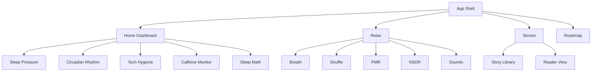

# Sleep Aid Product Design Document

Last updated: 2026-04-22

## Summary

Sleep Aid is a mobile-first sleep companion focused on low-friction, offline relaxation support. It helps users understand their current sleep biology, reduce pre-sleep arousal, and choose an appropriate wind-down intervention without creating another high-stimulation wellness dashboard.

The product should feel quiet, trustworthy, and immediately useful at night. It is not a medical device, diagnostic tool, or treatment product. It provides educational sleep hygiene guidance, cognitive downshifting exercises, guided rest scripts, calming stories, and browser-generated soundscapes.

## Product Positioning

| Dimension | Decision |
| --- | --- |
| Category | Offline sleep hygiene and relaxation utility |
| Primary device | Mobile web |
| Primary session time | Evening, bedtime, night waking, short rest breaks |
| Interaction model | Tap-and-settle, minimal typing, minimal configuration |
| Trust model | Conservative educational guidance, no diagnosis, no clinical claims |
| Data posture | No account, no tracking, no backend, no runtime secrets in current version |

## Problem Statement

Users who are trying to fall asleep often do not need a complex analytics product. They need a calm, reliable tool that answers one of three questions:

1. What should I do right now based on time of day?
2. How do I calm my physiology or attention without thinking too much?
3. Can I start a low-stimulation experience that does not require setup, login, or headphones unless desired?

Existing sleep apps often emphasize tracking, subscriptions, high-production audio libraries, or dashboards that require repeated data entry. Sleep Aid instead prioritizes immediate, offline interventions.

## Target Users

| Persona | Need | Product fit |
| --- | --- | --- |
| Stressed professional | Needs a fast decompression routine after screen-heavy work | 4-7-8 breathing, PMR, NSDR, low-light UI |
| Night-waking user | Needs a non-stimulating tool at 2 AM | Sleep stories, shuffle words, dark visual system |
| Sleep hygiene learner | Wants practical guidance without reading long articles | Dashboard cards for sleep pressure, circadian phase, caffeine, light |
| Focused nap/rest user | Wants a short reset, not necessarily sleep | NSDR and soundscapes |
| Mobile-first user | Wants no setup and no account | Offline static app, bottom navigation, local-only state |

## Goals

| Goal | Product implication |
| --- | --- |
| Reduce pre-sleep cognitive load | Keep navigation shallow, controls obvious, and copy concise |
| Support immediate relaxation | Make the Relax tab the richest intervention area |
| Explain sleep timing simply | Use biological concepts without overwhelming users |
| Avoid bright or stimulating UX | Warm dark palette, restrained motion, mobile width, low contrast where appropriate |
| Preserve privacy and reliability | No login, no backend dependency, no required network calls after load |
| Keep deployment simple | Static SPA in a container for Cloud Run |

## Non-Goals

- Diagnose insomnia, sleep apnea, anxiety, depression, or other conditions.
- Replace clinical CBT-I, medical care, or therapy.
- Track protected health information.
- Provide precision sleep staging without validated wearable data.
- Require a paid audio catalog or streamed assets.
- Add social, gamification, streak pressure, or high-alert notification loops.

## Product Principles

1. Night-safe by default
   - Dark, warm, low-stimulation UI.
   - No bright hero screens or attention-seeking visuals.
   - Minimal form entry.

2. Intervene before analyzing
   - The app should help the user do something useful immediately.
   - Analytics and education must not block relaxation workflows.

3. Calm motion, not decorative motion
   - Transitions should reduce abruptness.
   - Motion should communicate state, pacing, or progression.

4. Conservative science language
   - Prefer "may help", "supports", and "sleep hygiene guidance".
   - Avoid guaranteed outcomes or treatment claims.

5. Offline resilience
   - Core content and interventions should function without backend services.
   - Network failure should not break bedtime workflows after the app loads.

## Information Architecture

## Primary Navigation

| Tab | Current implementation | Product role |
| --- | --- | --- |
| Home | `Dashboard` | Gives current time-aware sleep guidance |
| Relax | `BreathingExercise` | Intervention hub for physiological and cognitive downshifting |
| Stories | `StoryMode` | Low-effort narrative distraction and rest cue |
| Roadmap | `Roadmap` | Makes product direction visible during early iteration |

## Core User Journeys

### Journey 1: Evening Wind-Down

1. User opens app in the evening.
2. Home shows circadian phase and low-light guidance.
3. User checks caffeine/light advice.
4. User opens Relax.
5. User starts breathing, PMR, NSDR, or soundscape.
6. User leaves the app open or locks into the routine without further configuration.

Success criteria:

- User reaches an intervention in under 2 taps from launch.
- Controls are readable in low light.
- Audio or haptic features start only after explicit user action.

### Journey 2: Racing Thoughts at Bedtime

1. User opens Relax.
2. User selects Shuffle.
3. App cycles simple visual words every few seconds.
4. User imagines each word and disengages from looping thoughts.

Success criteria:

- No typing required.
- Word display is large, centered, and low-stimulation.
- User can stop or switch modes easily.

### Journey 3: Night Waking

1. User opens Stories.
2. User picks a familiar story.
3. Reader view uses large serif text, warm color, and low-contrast presentation.
4. User exits back to library if needed.

Success criteria:

- Story library is scrollable and readable on mobile.
- Reader view avoids bright white backgrounds.
- Back action is clear and low-friction.

### Journey 4: Short Reset

1. User opens Relax during the day.
2. User selects NSDR.
3. User starts a short guided script.
4. App supports rest without framing it as bedtime-only.

Success criteria:

- Product supports daytime decompression without confusing the bedtime model.
- Copy distinguishes rest and sleep hygiene from medical treatment.

## Feature Catalog

| Feature | User value | Current status | Notes |
| --- | --- | --- | --- |
| Sleep pressure card | Explains homeostatic sleep drive | Live | Uses fixed wake-time assumption |
| Circadian card | Gives time-of-day guidance | Live | Time-aware local calculation |
| Caffeine monitor | Flags late caffeine risk | Live | Uses 2 PM cutoff |
| Sleep math | Suggests full-cycle wake times | Live | Assumes 15 minute latency and 90 minute cycles |
| 4-7-8 breathing | Guided paced breathing | Live | Haptic cues on supported devices |
| Shuffle words | Cognitive distraction | Live | Static word list, timed cycling |
| PMR | Somatic tension/release flow | Live | Step-based timer |
| NSDR | Guided rest scripts | Live | Text-guided, no speech synthesis yet |
| Soundscapes | Offline generated audio | Live | Web Audio generated noise and binaural tones |
| Sleep stories | Narrative wind-down | Live | Static library and reader |
| Roadmap | Transparent iteration plan | Live | May move to docs later |

## Content Strategy

### Voice and Tone

- Calm, specific, and practical.
- Avoid clinical certainty.
- Use simple biological explanations with concrete actions.
- Avoid moralizing sleep behavior.

Preferred examples:

- "Avoid bright overhead lights. Use warm lamps."
- "Caffeine consumed now may remain in your system at bedtime."
- "This can support wind-down, but it is not medical advice."

Avoid:

- "This will cure insomnia."
- "Your sleep score is bad."
- "You failed your routine."

### Medical and Wellness Guardrails

The product should include or preserve a clear health disclaimer before any public launch:

- Sleep Aid is educational and relaxation-focused.
- It is not a diagnostic or treatment tool.
- Users with persistent insomnia, breathing interruptions, severe anxiety, depression, or safety concerns should consult a qualified clinician.

## UX Requirements

| Area | Requirement |
| --- | --- |
| Layout | Mobile-first, max-width app shell, bottom navigation |
| Color | Warm dark theme, low blue-light feel, sufficient contrast for controls |
| Typography | Sans for UI, serif for restful reading content |
| Motion | Short transitions, spring easing, no high-energy effects |
| Controls | Large touch targets, clear active state, no hidden critical actions |
| Audio | User-initiated only, visible stop state, cleanup on mode change/unmount |
| Haptics | Optional, disabled by default, supported-device only |
| Offline | Core content works without API calls |
| Accessibility | Keyboard reachable controls, semantic buttons, readable text sizes |

## Success Metrics

Current app has no analytics. If metrics are added later, prefer privacy-preserving aggregate instrumentation.

| Metric | Why it matters | Privacy note |
| --- | --- | --- |
| Time to first intervention | Measures low-friction value | Can be local/session aggregate |
| Mode starts by type | Shows which tools users value | Avoid user-level profiling unless explicitly consented |
| Session completion for PMR/NSDR | Indicates routine usability | Aggregate only |
| Story opens and read duration | Measures content utility | No need to store story text events per user |
| Return usage | Indicates habit value | Use anonymous aggregate if tracking is added |

## Release Scope

### MVP

- Static SPA.
- Four-tab navigation.
- Home dashboard.
- Relaxation tools.
- Static story library.
- Cloud Run deployment.

### V1 Hardening

- Public health disclaimer.
- Accessibility pass.
- Playwright smoke tests for tab navigation.
- More robust soundscape cleanup and browser compatibility handling.
- Basic error boundaries for lazy-loaded views.

### V2 Candidates

| Candidate | Value | Tradeoff |
| --- | --- | --- |
| Resonance breathing tuner | More personalized breathing cadence | More settings complexity |
| True OLED midnight mode | Lower photon output | Theme management overhead |
| Speech synthesis for scripts | Eyes-closed NSDR/PMR | Browser voice variability |
| Local preferences | Better repeat use | Must avoid overcomplicating setup |
| More story packs | Content depth | Editorial maintenance |
| PWA install | Faster repeat access | Service worker cache invalidation complexity |

## Risks and Mitigations

| Risk | Impact | Mitigation |
| --- | --- | --- |
| Product makes clinical claims | Trust and compliance risk | Keep copy educational, add disclaimer |
| Audio causes discomfort | Poor user experience | Keep volume subtle, add clear stop controls, avoid autoplay |
| Night UI still too bright | Product undermines purpose | Add OLED midnight mode and brightness review |
| Feature creep turns app into a dashboard | Increased cognitive load | Keep intervention-first IA |
| No tests for navigation | Regressions in core flows | Add Playwright smoke tests |
| Browser API differences | Audio/haptics inconsistency | Feature-detect APIs and degrade gracefully |

## Open Product Questions

- Should the Home dashboard assume a default wake time of 7 AM, or should wake time become a local preference?
- Should stories remain text-only, or should narration/speech synthesis become a first-class mode?
- Should the Roadmap remain in-app, or move to documentation once the app is public?
- Should any analytics be added, or should the product remain entirely uninstrumented?
- Should PWA offline caching be added before public launch?

## Decision Log

| Date | Decision | Rationale |
| --- | --- | --- |
| 2026-04-22 | Keep app offline/static | Simplifies deployment, privacy, and reliability |
| 2026-04-22 | Use Cloud Run container instead of static hosting | Aligns with GCP Cloud Build workflow and future backend flexibility |
| 2026-04-22 | Use Tailwind in the Vite build, not CDN | Production correctness and deterministic builds |
| 2026-04-22 | Serve static build via nginx | Avoids using Vite preview as production server |
