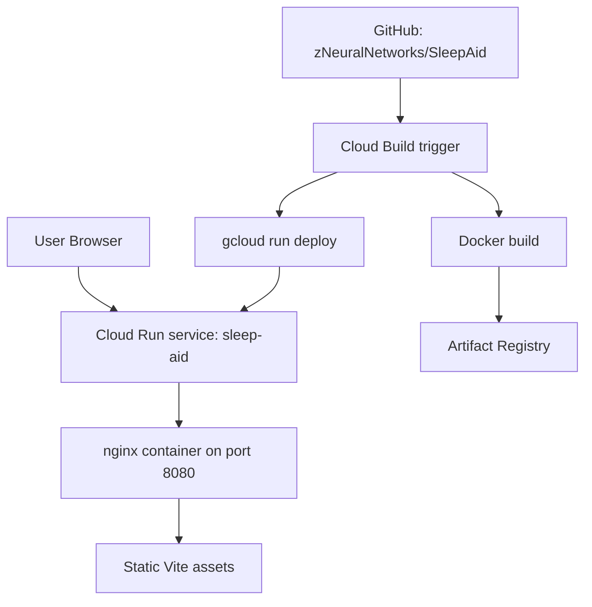
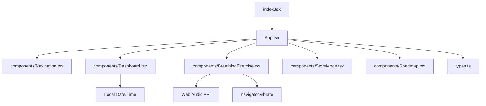
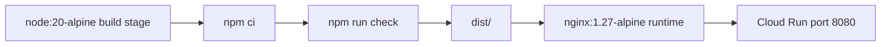

# Sleep Aid Technical Design Document

Last updated: 2026-04-22

## Summary

Sleep Aid is a client-only React/Vite single-page app. It is built into static assets, copied into an nginx container, pushed to Artifact Registry by Cloud Build, and deployed to Cloud Run. The current runtime has no backend service, database, authentication layer, or private secrets.

The technical design optimizes for a small operational surface:

- Deterministic `npm ci` builds.
- TypeScript checking during Docker build.
- Tailwind CSS compiled into the Vite production bundle.
- nginx serving immutable static assets and SPA fallback.
- Cloud Build performing image build, push, and Cloud Run deploy.

## Current Architecture



## Runtime Characteristics

| Characteristic | Current state |
| --- | --- |
| Rendering | Client-side React SPA |
| Runtime server | nginx |
| Runtime port | `8080` |
| Backend | None |
| API calls | None in current app code |
| Secrets | None |
| Persistence | None |
| Auth | None |
| Analytics | None |
| Offline behavior | Static content works after app load; no service worker yet |

## Codebase Architecture

Code-review graph status on 2026-04-22:

| Metric | Value |
| --- | --- |
| Files indexed | 9 |
| Nodes | 29 |
| Edges | 242 |
| Languages | `tsx`, `typescript` |
| Main communities | App shell and component feature set |

High-level module boundaries:



## Key Files

| File | Responsibility |
| --- | --- |
| `index.tsx` | React root creation and global CSS import |
| `index.html` | Minimal Vite entry document |
| `index.css` | Tailwind import, theme variables, custom keyframes, compatibility utilities |
| `App.tsx` | View state, lazy loading, transitions, layout shell |
| `types.ts` | `AppView` enum and shared sleep stat type |
| `components/Navigation.tsx` | Bottom tab navigation |
| `components/Dashboard.tsx` | Time-derived sleep pressure, circadian, caffeine, sleep math, sleep hygiene cards |
| `components/BreathingExercise.tsx` | Relaxation mode state, breathing timers, shuffle words, NSDR, PMR, soundscape generation |
| `components/StoryMode.tsx` | Static story list and reader view |
| `components/Roadmap.tsx` | In-app roadmap timeline |
| `vite.config.ts` | Vite, React, Tailwind, dev server, path alias |
| `Dockerfile` | Multi-stage production container |
| `nginx.conf` | Static asset cache rules and SPA fallback |
| `cloudbuild.yaml` | GCP build/push/deploy pipeline |

## Frontend Design

### App Shell

`App.tsx` owns the active view as local state:

```text
AppView.DASHBOARD -> Dashboard
AppView.BREATHE   -> BreathingExercise
AppView.STORY     -> StoryMode
AppView.ROADMAP   -> Roadmap
```

Views are lazy-loaded with `React.lazy` and rendered through `Suspense`. `AnimatePresence` and `motion.div` provide short cross-view transitions.

Design implications:

- Initial bundle avoids eagerly loading every feature view.
- Navigation is stateful but not URL-addressable.
- Refresh always returns to the dashboard.

Future consideration:

- If deep linking or browser history becomes important, replace local view state with React Router or a small URL state adapter.

### Dashboard

`Dashboard.tsx` derives sleep context from local time only.

Core calculations:

| Model | Current implementation |
| --- | --- |
| Sleep pressure | Assumes wake time of `7` and maps hours awake across a 16 hour window |
| Circadian phase | Buckets current hour into morning, daytime, evening, and night phases |
| Caffeine risk | Treats caffeine after `14:00` as risky |
| Sleep math | Adds 15 minute latency plus 90 minute cycles |

Technical risk:

- Fixed wake time is simple but not personalized.
- Time-zone behavior depends entirely on the browser local clock.

### Relaxation Tools

`BreathingExercise.tsx` is the largest feature module. It owns several independent mode state machines inside one component.

Modes:

| Mode | State model | Browser APIs |
| --- | --- | --- |
| Breath | Async timer loop with phase state | `navigator.vibrate` if enabled/supported |
| Shuffle | Interval-based word index | None |
| PMR | Timeout-based step progression | None |
| NSDR | Selected script state | None |
| Sounds | Audio context, nodes, active preset | Web Audio API |

Important cleanup behavior:

- Audio context is closed by `stopAudio`.
- Audio is stopped on component unmount.
- Mode changes call `stopAudio` for non-sound modes.
- Breathing loop uses cancellation flag in effect cleanup.

Technical risks:

- `audioNodesRef` is typed as `any[]`; this should be narrowed if audio complexity grows.
- Pink noise approximation defines unused variables today.
- Multiple timer modes share `isActive`; this is acceptable now but should be split if modes gain richer controls.

### Story Mode

`StoryMode.tsx` uses static story objects and local selected-story state.

Design:

- Library list renders story cards.
- Selecting a story switches to reader view.
- Reader splits content paragraphs on newlines.

Technical risk:

- Long static content inside component code will become hard to maintain if the story library grows.

Future direction:

- Move story data to `data/stories.ts`.
- Add content validation for duration, tags, title, and paragraph formatting.

## Data Model

Current data is static and local.

```typescript
export enum AppView {
  DASHBOARD = 'DASHBOARD',
  ROADMAP = 'ROADMAP',
  BREATHE = 'BREATHE',
  STORY = 'STORY'
}
```

Feature-local data shapes:

| Data | Location | Notes |
| --- | --- | --- |
| Sleep facts | `Dashboard.tsx` | Static string array |
| Sound presets | `BreathingExercise.tsx` | Includes carrier frequency, beat frequency, noise type |
| Shuffle words | `BreathingExercise.tsx` | Static word list |
| NSDR sessions | `BreathingExercise.tsx` | Static scripts |
| PMR steps | `BreathingExercise.tsx` | Static timed sequence |
| Stories | `StoryMode.tsx` | Static story list |
| Roadmap items | `Roadmap.tsx` | Static roadmap entries |

Recommended next refactor:

```text
data/
  sleepFacts.ts
  relaxation.ts
  stories.ts
  roadmap.ts
```

This is not required for current scale, but it will reduce component size as content grows.

## Build System

### npm Scripts

| Script | Command | Purpose |
| --- | --- | --- |
| `dev` | `vite` | Local development |
| `build` | `vite build` | Production static build |
| `preview` | `vite preview` | Local preview only, not production serving |
| `typecheck` | `tsc --noEmit` | TypeScript validation |
| `check` | `npm run typecheck && npm run build` | Required pre-push and Docker build check |

### Vite

`vite.config.ts` includes:

- React plugin.
- Tailwind CSS Vite plugin.
- `@` alias to repo root.
- Dev server host `0.0.0.0`.
- Dev server port `3000`.
- Preview `allowedHosts: true`.

### CSS

Tailwind CSS is built through Vite:

```css
@import "tailwindcss";
```

Production correctness depends on:

- `index.tsx` importing `./index.css`.
- `vite.config.ts` registering `@tailwindcss/vite`.
- `index.html` not relying on the Tailwind CDN.

## Container Design

`Dockerfile` uses a two-stage build:



Build stage:

1. Copy `package*.json`.
2. Run `npm ci`.
3. Copy source.
4. Run `npm run check`.

Runtime stage:

1. Copy `nginx.conf`.
2. Copy built `dist/`.
3. Expose `8080`.
4. Run nginx in foreground.

Why nginx:

- Production static serving.
- Avoids using `vite preview` as a production server.
- Provides explicit cache rules and SPA fallback.

## nginx Design

`nginx.conf`:

| Location | Behavior |
| --- | --- |
| `/assets/` | Serve existing hashed assets, return 404 if missing, immutable cache |
| `/` | Try file, directory, then fallback to `/index.html`, no-cache |

Important invariant:

```nginx
listen 8080;
```

This must match `cloudbuild.yaml` Cloud Run deploy argument:

```text
--port=8080
```

## GCP Deployment Design

### Cloud Build Pipeline

`cloudbuild.yaml` has four steps:

| Step | Builder | Purpose |
| --- | --- | --- |
| `ensure-artifact-registry` | `gcloud` | Create Artifact Registry repo if absent |
| `build-image` | Docker builder | Build image tagged with commit SHA and latest |
| `push-image` | Docker builder | Push all tags |
| `deploy-cloud-run` | `gcloud` | Deploy commit SHA image to Cloud Run |

### Default Substitutions

| Name | Value |
| --- | --- |
| `_REGION` | `us-central1` |
| `_SERVICE` | `sleep-aid` |
| `_AR_REPO` | `sleep-aid` |

### Required GCP Services

- Cloud Build API.
- Artifact Registry API.
- Cloud Run API.
- IAM API.

### Required IAM

The Cloud Build trigger service account needs practical permissions for:

- Writing build logs.
- Creating or writing Artifact Registry Docker repositories.
- Deploying Cloud Run services.
- Acting as the Cloud Run runtime service account.

See `README.md` for concrete `gcloud` commands.

## GitHub Integration

Target repository:

```text
https://github.com/zNeuralNetworks/SleepAid
```

Recommended trigger:

- Source: GitHub.
- Event: push to branch.
- Branch regex: `^main$`.
- Config path: `cloudbuild.yaml`.

Branch policy:

- `main` is the deployment branch.
- PR checks should run `npm run check` when CI is added.
- Deploy-related changes should be container-tested before merge when Docker is available.

## Security and Privacy

Current security posture:

| Area | Current design |
| --- | --- |
| Secrets | None used |
| User data | None collected |
| Network calls | None from app runtime |
| Authentication | None |
| Backend attack surface | None |
| Browser APIs | Web Audio and optional haptics |

Security constraints for future work:

- Do not ship private API keys in browser code.
- Only expose `VITE_*` environment variables intended for public client use.
- If AI features return, route private model calls through a backend service.
- Add a content/security review before adding analytics, auth, or persistence.

Recommended HTTP hardening for future container updates:

- `X-Content-Type-Options: nosniff`.
- `Referrer-Policy: no-referrer` or `strict-origin-when-cross-origin`.
- Basic Content Security Policy after external font strategy is finalized.

## Accessibility

Current app uses semantic buttons for most controls and readable mobile sizing. Accessibility should be hardened before public launch.

Recommended work:

- Add visible focus states where browser defaults are insufficient.
- Confirm all icon-only buttons have accessible names.
- Add reduced-motion handling for users with `prefers-reduced-motion`.
- Confirm color contrast in low-light palette.
- Test keyboard navigation across all tabs and modes.

## Performance

Current performance tactics:

- Lazy-loaded route-level feature components.
- Static SPA output.
- Hashed assets with immutable caching.
- No backend round trips for core workflows.

Watch points:

- `BreathingExercise.tsx` may grow large as more modes are added.
- Story/script content in component bundles increases JS size.
- Framer Motion is valuable for UX but contributes to bundle size.

Potential improvements:

- Move large static content into lazy-loaded data modules.
- Add bundle analysis before adding large libraries.
- Consider PWA caching after the deployment path is stable.

## Testing Strategy

Current checks:

```bash
npm run check
```

This covers:

- TypeScript compilation.
- Production Vite build.

Recommended next tests:

| Test | Scope |
| --- | --- |
| Playwright smoke | App loads, each bottom tab opens, core buttons are clickable |
| Audio smoke | Soundscape starts and stops without uncaught errors |
| PMR timer smoke | Start/pause/restart does not break progression |
| Story reader smoke | Story opens and returns to library |
| Container smoke | nginx serves `/`, `/assets/*`, and SPA fallback |

## Observability

Current:

- Cloud Run request logs.
- Cloud Build logs.
- No client analytics or error reporting.

Future options:

- Cloud Run logs for deployment/runtime health.
- Lightweight client error reporting only if privacy policy supports it.
- Synthetic uptime check against the Cloud Run URL.

## Failure Modes

| Failure | Cause | Detection | Mitigation |
| --- | --- | --- | --- |
| Build fails at `npm ci` | Lockfile mismatch | Cloud Build logs | Run `npm install`, commit lockfile |
| Build fails at typecheck | TypeScript error | `npm run check` | Fix locally before push |
| Production CSS missing | Tailwind config/import regression | Visual check, build artifact | Keep `index.css` import and Vite plugin |
| Cloud Run returns 404 on refresh | Missing SPA fallback | Browser refresh on path | Preserve nginx fallback |
| Sound does not start | Browser autoplay/audio-context policy | User report, console | Keep audio user-initiated |
| Haptics unavailable | Unsupported browser/device | Feature detection | Gracefully no-op |

## Code Review Graph Workflow

The local graph is generated at:

```text
.code-review-graph/graph.db
```

Rebuild after meaningful source changes:

```bash
uvx code-review-graph build --repo .
```

Check status:

```bash
uvx code-review-graph status --repo .
```

Use graph tools before broad code scans for:

- Architecture overview.
- Impact analysis.
- Hotspot identification.
- Change review.
- Dependency tracing.

The graph directory is intentionally ignored by git.

## Technical Debt

| Item | Impact | Suggested fix |
| --- | --- | --- |
| Large `BreathingExercise.tsx` | Harder to maintain as modes grow | Split mode components and static data |
| Static content embedded in components | Content edits touch UI files | Move content to `data/` modules |
| No automated browser tests | UI regressions can slip | Add Playwright smoke tests |
| No URL routing | No deep links to modes/stories | Add router or URL state if needed |
| No reduced-motion handling | Accessibility gap | Respect `prefers-reduced-motion` |
| No public health disclaimer | Product trust/compliance risk | Add disclaimer in app or footer/about |

## Future Architecture Options

### PWA

Add service worker and manifest for installability/offline repeat use.

Tradeoffs:

- Better mobile access.
- Requires cache invalidation discipline.

### Backend for AI or Personalization

Add a small backend only if features require private API keys, persistence, or secure computation.

Tradeoffs:

- Enables AI coaching or account state.
- Increases operational and privacy surface.

### Local Preferences

Store preferences such as wake time, theme, haptics preference, and preferred breathing cadence in `localStorage`.

Tradeoffs:

- Better personalization.
- Requires migration/default handling and privacy review.

## Decision Log

| Date | Decision | Reason |
| --- | --- | --- |
| 2026-04-22 | Use React/Vite static SPA | Simple, fast, suitable for offline utility |
| 2026-04-22 | Use Tailwind via Vite plugin | Deterministic production styling |
| 2026-04-22 | Use nginx runtime container | Production static serving and Cloud Run compatibility |
| 2026-04-22 | Use Cloud Build and Cloud Run | Aligns with target GitHub/GCP workflow |
| 2026-04-22 | Keep generated graph out of git | Graph DB is local tool state |
